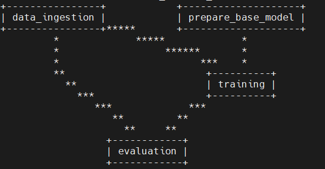

# Kidney disease classification

- [Dataset](https://www.kaggle.com/datasets/nazmul0087/ct-kidney-dataset-normal-cyst-tumor-and-stone/data)
- [Keras pre-trained models](https://keras.io/api/applications/)
- [MLflow](https://mlflow.org/docs/latest/index.html)

- MLFLOW environment variables:
    - `export MLFLOW_TRACKING_URI=<TRACK URI>`
    - `export MLFLOW_TRACKING_USERNAME=<USERNAME>`
    - `export MLFLOW_TRACKING_PASSWORD=<PASSWORD>`

- DVC commands:
    - Create the `dvc.yaml` file
    - Execute: `dvc init`
    - Execute: `dvc repro`
    - Generate dependency graph: `dvc dag`
    
    